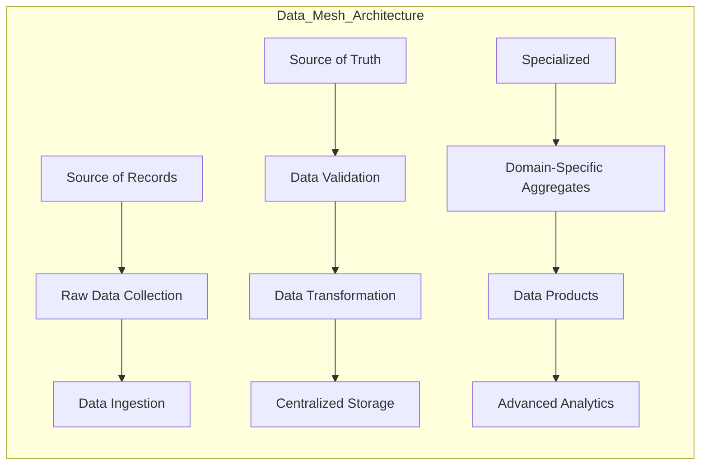

# Data Mesh

- Descentralizado
- Orientado ao domínio
- Consumidor como cliente

## Produto de dados

- Seguro
- Valioso
- Interoperável
- Acessível
- Descobrível
- Compreensível
- Verdadeiro (fidedigno)

## Camadas

- Source of Records
- Source of Truth
- Specialized

#DataEngineer #DataMeshConcepts
