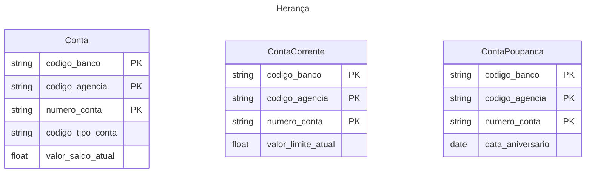

- Entidades pais e filhas
- Generalização ou supertipo (Pai)
- Especialização ou subtipo (Filha)

## Generalização Total ou completa

Toda ocorrência de um supertipo deve ser especializado, Ex: para toda _conta_ deve existir uma _conta corrente_ ou _conta poupança_

## Generalização Parcial ou incompleta

Pode existir uma conta sem especialização

## Especialização mutuamente exclusiva

- Não pode haver mais de uma especialização para o mesmo objeto

## Especialização mutuamente não exclusiva

- Pode pode haver mais de uma especialização para o mesmo objeto, ou seja, dois papeis ao mesmo tempo
