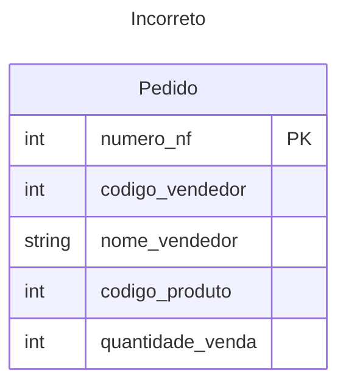
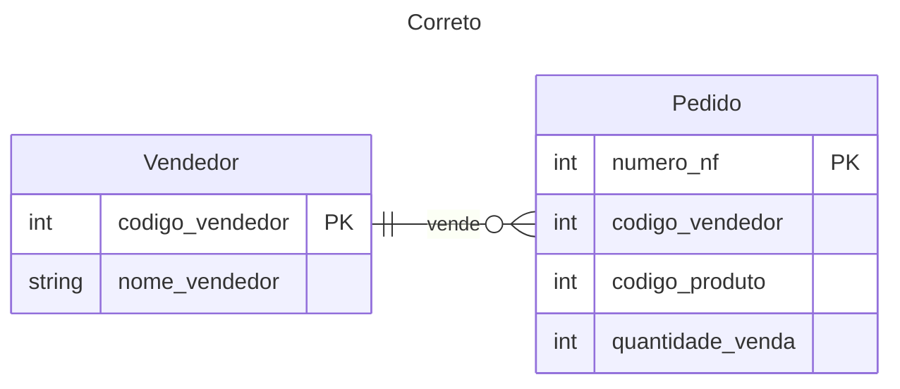

- Deve estar aderente a primeira e segunda formas normais
- Não apresentar dependência funcional transitiva. Ex:

- [[data-engineer.concepts.data-modeling.sql.data-modeling-normalization-first-form]]
- [[data-engineer.concepts.data-modeling.sql.data-modeling-normalization-second-form]]
