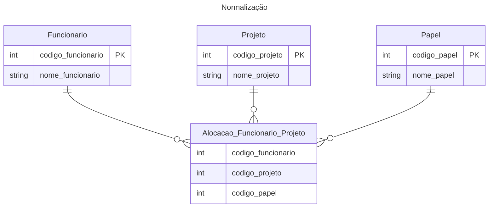

- Resolver anomalias de inserção, atualização e exclusão de dados
- Eliminar redundância de dados
- Reduzir a necessidade de manutenção do modelo

[[data-engineer.concepts.data-modeling.sql.data-modeling-normalization-first-form]]
