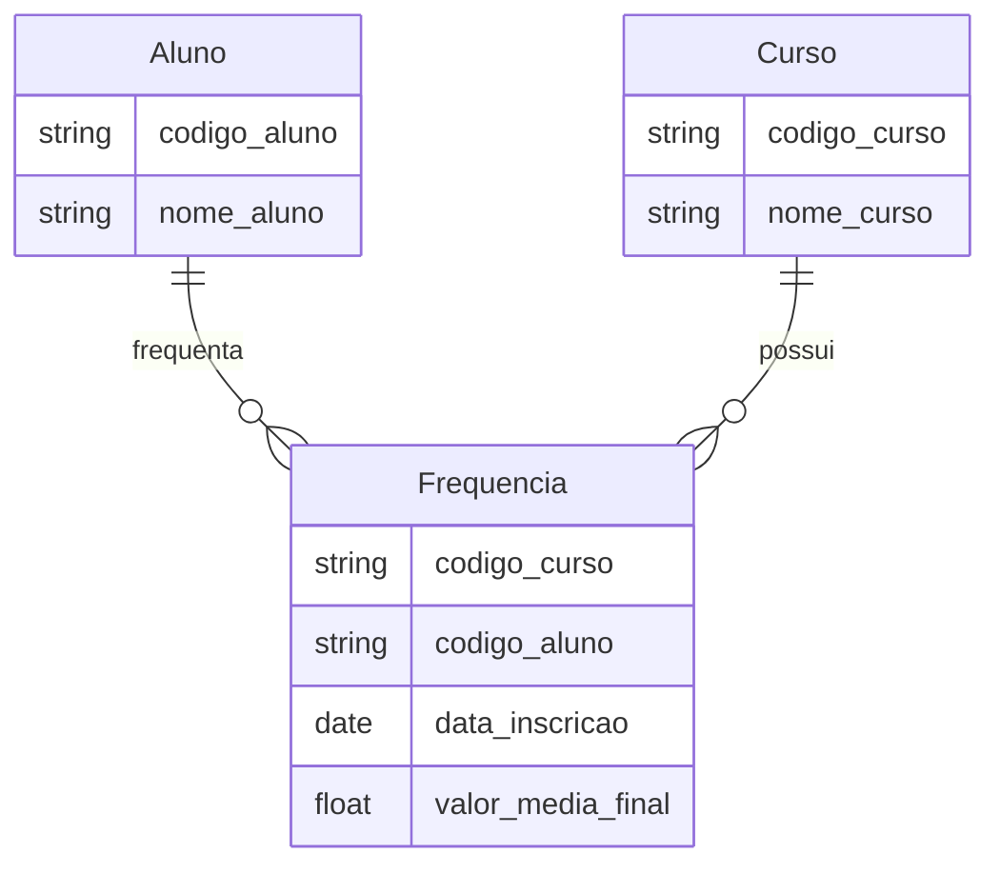

Indica o numero de vezes em que um elemento de uma entidade pode se associar com elementos de outras entidades. Deve ser analisada em ambas as direções de um relacionamento.

## 1:1

## 1:N

## M:N

- Entidade associativa

## Cardinalidade mínima e máxima

- Cardinalidade mínima: indica a opcionalidade do relacionamento
- Cardinalidade máxima: Representa a cardinalidade do relacionamento
  - 0: Possibilidade de não participação ou opcionalidade
  - 1: Indica a obrigatoriedade de participação

#DataEngineer #DataModelingConcepts #DataModelingCardinality
