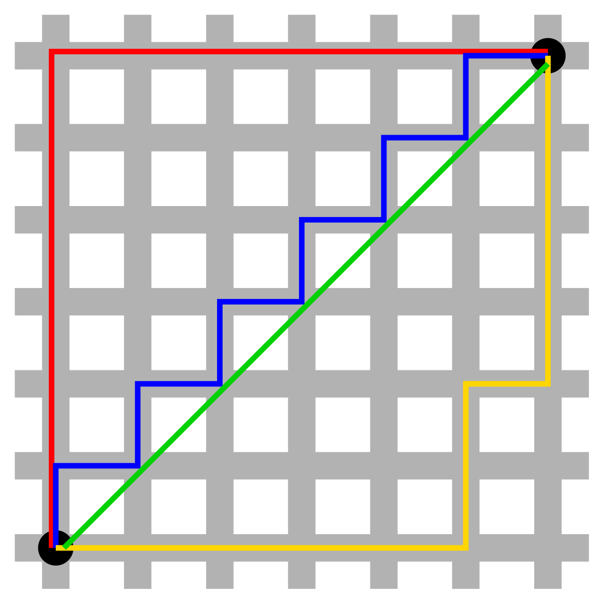

> K-Nearest Neighbors

- Método de aprendizagem supervisionada
- Utilizado para classificação e regressão
- Cálculo de distância entre os dados para realizar a classificação (similaridade entre features)
- Algoritmo _Lazy_ (Não há fase de treinamento, apenas armazenamento dos dados)
- Hiperparâmetro K: número de vizinhos mais próximos a serem considerados na classificação
- Util para pequenas bases de dados
- Multi classe e binária
- Não paramétrico (não faz suposições sobre a distribuição dos dados)
- Baseado em instâncias (Instance-based learning)
- Quanto menor o K, maior o risco de _Overfitting_ [[data-science.machine-learning.overfitting]]
- Quanto maior o K, maior o risco de _Underfitting_
- K pode ser ajustado com validação cruzada
- K comumente é um número ímpar para evitar empates em classificação binária

## Etapas

1. Calcule a distância entre o novo objeto sem classificação e todos objetos classificados existentes
2. Ordene de forma ascendente as distâncias calculadas
3. Realize a somatória das classes ate K exemplares
4. Atribua a classe ganhadora ao novo objeto

- Para evitar empate entre as classes escolha um valor de `K` impar
- Escolha um K pequeno

### Distâncias

#### Euclidiana

$$
d(p,q) = \sqrt{\sum_{i=1}^{n} (p_i - q_i)^2}
$$

#### Manhattan

Geometria do taxi

$$
d(p, q) = \sum_{i=1}^{n} \lvert p_i - q_i \rvert
$$

#### Minkowski

$$
d(p, q) = \left( \sum_{i=1}^{n} \lvert p_i - q_i \rvert^m \right)^{\tfrac{1}{m}}
$$

#### Jaccard

## Prós

## Contras

- Não possui uma fase de treino, então o custo computacional pode ser alto na fase de predição. Toda vez que uma predição é feita, o algoritmo precisa calcular a distância entre o ponto a ser classificado e todos os outros pontos do conjunto de dados de treinamento. Isso pode ser melhorado com estruturas de dados como _KD-Trees_ ou _Ball-Trees_, mas ainda sim pode ser inssuficiente para conjuntos de dados muito grandes.
- A eficiência do algoritmo diminui a medida que o conjunto de dados aumenta
- O algoritmo não lida bem com _missings_, sendo necessário preencher os dados faltantes
- Sofre de distribuição desigual de classes (classes majoritárias tendem a dominar a classificação)
- A acurácia é deteriorada em dados com alta dimensionalidade (muitas features). KNN sofre com a "maldição da dimensionalidade", onde a distância entre os pontos se torna menos significativas à medida que o número de dimensões aumenta. Isso pode levar a classificações imprecisas.

## Aplicação

- Sistemas de recomendação para anúncios no Youtube ou produtos na Amazon.
- Utilização no varejo para detectar padrões em uso de cartões de crédito e identificar possíveis fraudes
- Predição de votos potências em eleições com base em dados demográficos e históricos de votação
- Reconhecimento de video
- Reconhecimento de imagem
- Reconhecimento de escrita de mão

## Links úteis

- [KNN EXEMPLO COMPLETO](https://www.youtube.com/watch?v=zvmbB3315Ko)
