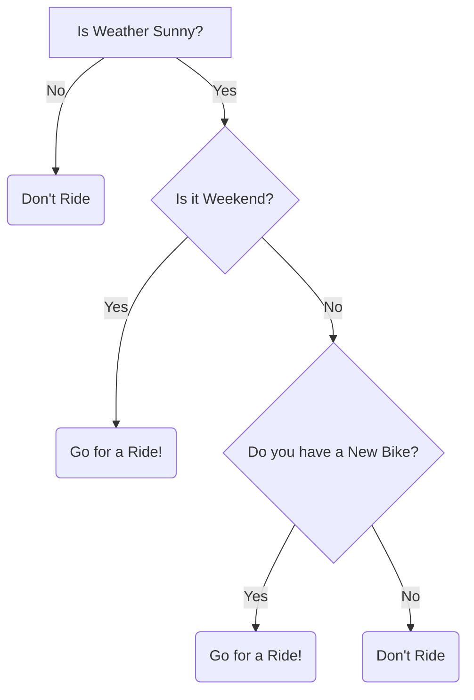

## O que é?

São algoritmos de machine learning que dividem os conjuntos de dados progressivamente em pequenos grupos de dados baseado em uma _feature_ descritiva até que alcancem conjuntos pequenos o suficiente para que sejam descritos por algum _label_

- Classificação
- Regressão (variável dependente continua ou quantitativa)
- Supervisionado (variável dependente categórica ou qualitativa)
- Não paramétrico

| Weather | Weekend | New Bike | Ride |
| :-----: | :-----: | :------: | :--: |
|    0    |    0    |    0     |  0   |
|    0    |    0    |    1     |  0   |
|    0    |    1    |    0     |  0   |
|    0    |    1    |    1     |  0   |
|    1    |    0    |    0     |  0   |
|    1    |    0    |    1     |  1   |
|    1    |    1    |    0     |  1   |
|    1    |    1    |    1     |  1   |

### Características

São compostas por nós galhos e folhas. Cada nó representa um atributo (feature), cada galho representa uma regra ou decisão, e cada folha representa um _outcome_. A profundeza da árvore é definida pelo número de níveis, não incluindo o nó raiz.

Dado um conjunto de dados, o algoritmo tenta agrupar e rotular observações que são similares, e separar observações com baixo grau de semelhança. É utilizado um método de separação em camadas onde cada camada separa os dados em dois ou mais grupos, e a separação pode ser binária ou em múltiplos caminhos.

Conforme o número de galhos cresce, a complexidade aumenta assim como o risco de overfitting [[data-science.machine-learning.glossary.overfitting]] e a dificuldade de interpretação

#### Algoritmos

##### CART

Classification and Regression Trees

- Utiliza _Gini_ como métrica

##### ID3

Iterative Dichotomiser 3

- Utiliza _função de entropia_ e _ganho de informação_ como métricas

## Complexidade

## Hiperparâmetro

### Como escolher o valor

## Métricas

### Clarificação

- Gini Index: Mede o quanto impuro é um nó.
- Entropy: Mede a quantidade de desordem nos dados.

### Regressão

- Residual
- Mean Square Error

## Etapas

### Pruning (Podá)

É uma técnica para lidar com _overfitting_ [[data-science.machine-learning.glossary.overfitting]] removendo sessões da árvore

## Vantagens

- Fácil de entender/interpretar
- Fácil de explicar o resultado do modelo
- Requer menos dados de treino comparado a outros modelos
- Toleram valores faltantes
- Não requer feature scaling (normalização [[data-science.machine-learning.data-preprocessing.normalization]] ou padronização [[data-science.machine-learning.data-pre-processing.standardization]])

## Desvantagens

- Performam bem com os dados utilizados para cria-las, mas não são flexíveis na classificação de novas amostras
- São propensos a overfitting e sensíveis a outliers
- São _Weak Learners_, uma única árvore de decisão geralmente não faz boas predições, então geralmente múltiplas árvores são combinadas para fazer florestas e melhorar os resultados
- Instáveis, pequenas mudanças nos dados podem gerar diferenças significantes na estrutura da árvore e previsões

## Aplicação

- Medicina (Diagnostico de doenças)
- Reconhecimento de pedestres por carros antônomos
- Agricultura (Reconhecimento de imagem)
- Detecção de fraude financeira
- Aprovação de empréstimos bancários
- Churn

## Comparação

## Dicas

## Utilização

## Links úteis

- [math-behind-decision-tree-algorithm](https://ankitnitjsr13.medium.com/math-behind-decision-tree-algorithm-2aa398561d6d)
- [gini-impurity](https://victorzhou.com/blog/gini-impurity/)
