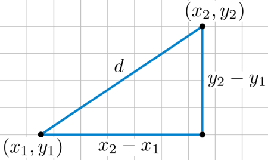
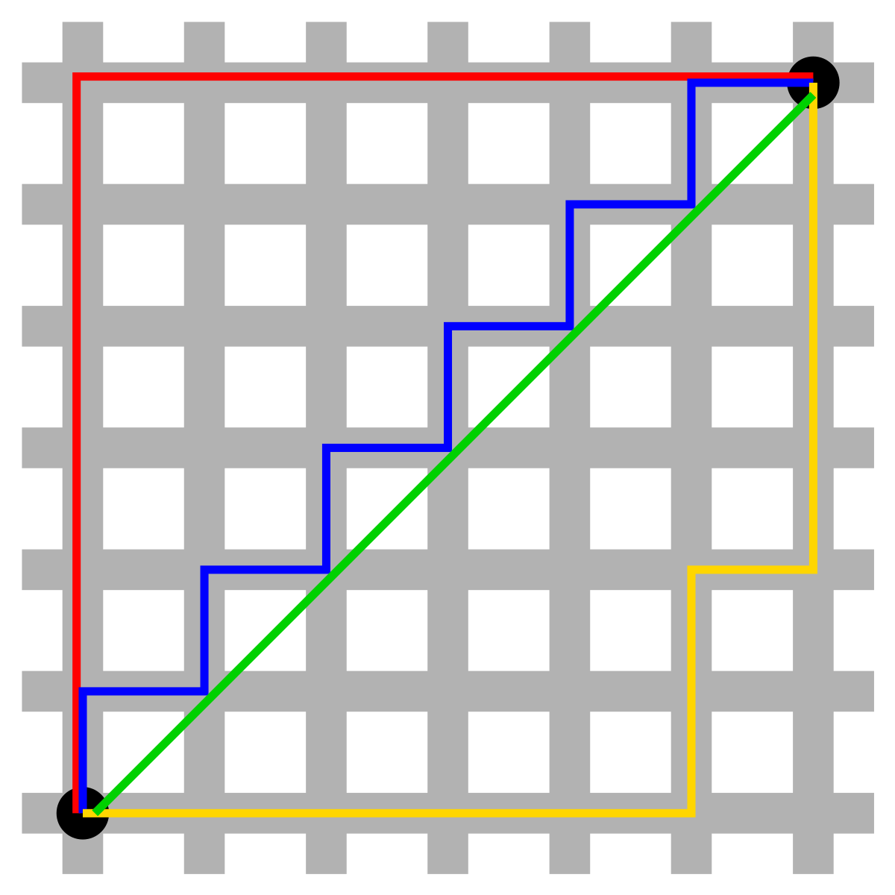

> "Diga-me com quem andas, que te direi quem és". Provérbio

## O que é?

> "K-Nearest Neighbors"

Nós costumamos a julgar as pessoas pelo grupo ao qual elas se relacionam.

- Um método de aprendizagem supervisionada uma vez que sua variável alvo é conhecida
- Algoritmo _Lazy_ (Não há fase de treinamento, apenas armazenamento dos dados), Logo ele não aprende, mas memoriza
- Cálculo de distância entre os dados para realizar a classificação (similaridade entre features)

### Características

- Util para pequenas bases de dados
- Multi classe e binária
- Baseado em instâncias (Instance-based learning)

## Complexidade

## Hiperparâmetro K

- K comumente é um número ímpar para evitar empates em classificação binária
- Quanto menor o K, maior o risco de _Overfitting_ [[data-science.machine-learning.glossary.overfitting]]
- Quanto maior o K, maior o risco de _Underfitting_
- K pode ser ajustado com validação cruzada
- K tem uma relação inversa com variância, uma vez que o K aumenta a variância diminui

### Como escolher o valor de K?

- Plotar a _taxa de acurácia_ ou _F1 Score_ para diferentes valores de K

## Etapas

1. Calcule a [distância](#distâncias) entre o novo objeto sem classificação e todos objetos classificados existentes, estas distâncias serão armazenadas em memória
2. Ordene de forma ascendente as distâncias calculadas
3. Armazene os _K_ pontos mais próximos
4. Calcule a proporção de cada classe e armazene em memória
5. Atribua a classe com maior proporção

### Distâncias

#### Euclidiana (L2 norm)

$$
d(p,q) = \sqrt{\sum_{i=1}^{n} (p_i - q_i)^2}
$$

| Customer | Age | Income | No. credit cards | Class | Distance from John (Formula)            |
| -------- | --- | ------ | ---------------- | ----- | --------------------------------------- |
| George   | 35  | 35K    | 3                | No    | $$\sqrt{(35-37)^2+(35-50)^2+(3-2)^2}$$  |
| Rachel   | 22  | 50K    | 2                | Yes   | $$\sqrt{(22-37)^2+(50-50)^2+(2-2)^2}$$  |
| Steve    | 63  | 200K   | 1                | No    | $$\sqrt{(63-37)^2+(200-50)^2+(1-2)^2}$$ |
| Tom      | 59  | 170K   | 1                | No    | $$\sqrt{(59-37)^2+(170-50)^2+(1-2)^2}$$ |
| Anne     | 25  | 40K    | 4                | Yes   | $$\sqrt{(25-37)^2+(40-50)^2+(4-2)^2}$$  |
| John     | 37  | 50K    | 2                | YES   | -                                       |

</br>



Cálculo da distância em `python` utilizando o pacote `scipy`:

```py
from scipy.spatial import distance

point_1 = (1, 2, 3)
point_2 = (4, 5, 6)

euclidean_distance = distance.euclidean(point_1, point_2)
print(
    'Euclidean Distance of ',
    point_1,
    'and',
    point_2,
    'is: ',
    euclidean_distance
)
```

#### Manhattan

_Geometria do taxi_, Lembra as ruas de Manhattan.

$$
d(p, q) = \sum_{i=1}^{n} \lvert p_i - q_i \rvert
$$



Cálculo da distância em `python` utilizando o pacote `scipy`:

```py
from scipy.spatial import distance

point_1 = (1, 2, 3)
point_2 = (4, 5, 6)

manhattan_distance = distance.cityblock(point_1, point_2)
print(
    'Manhattan Distance of ',
    point_1,
    'and',
    point_2,
    'is: ',
    manhattan_distance
)
```

#### Minkowski

$$
d(p, q) = \left( \sum_{i=1}^{n} \lvert p_i - q_i \rvert^m \right)^{\tfrac{1}{m}}
$$

Cálculo da distância em `python` utilizando o pacote `scipy`:

```py
from scipy.spatial import distance

point_1 = (1, 2, 3)
point_2 = (4, 5, 6)

minkowski_distance = distance.minkowski(point_1, point_2, p=3)
print(
    'Minkowski Distance of ',
    point_1,
    'and',
    point_2,
    'is: ',
    minkowski_distance
)
```

#### Jaccard

#### Hamming

- Utilizada para valores categóricos, nos diz se dois valores categóricos são iguais.

## Vantagens

- Algoritmo simples, fácil de se interpretar
- Não paramétrico (não faz suposições sobre a distribuição dos dados)
- Utilizado para classificação e regressão
- Treinamento rápido comparado a outros algoritmos

## Desvantagens

- Não possui uma fase de treino, então o custo computacional pode ser alto na fase de predição. Toda vez que uma predição é feita, o algoritmo precisa calcular a distância entre o ponto a ser classificado e todos os outros pontos do conjunto de dados de treinamento. Isso pode ser melhorado com estruturas de dados como _KD-Trees_ ou _Ball-Trees_, mas ainda sim pode ser inssuficiente para conjuntos de dados muito grandes.
- Alto requerimento de memória uma vez que o KNN precisa armazenar todos pontos de dados
- A eficiência do algoritmo diminui a medida que o conjunto de dados aumenta
- O algoritmo não lida bem com _missings_, sendo necessário preencher os dados faltantes
- Sofre de distribuição desigual de classes (classes majoritárias tendem a dominar a classificação)
- A acurácia é deteriorada em dados com alta dimensionalidade (muitas features). KNN sofre com a "maldição da dimensionalidade", onde a distância entre os pontos se torna menos significativas à medida que o número de dimensões aumenta. Isso pode levar a classificações imprecisas.
- Sensível a outliers, a acurácia é comprometida por dados irrelevantes.

## Aplicação

- Sistemas de recomendação para anúncios no Youtube ou produtos na Amazon.
- Utilização no varejo para detectar padrões em uso de cartões de crédito e identificar possíveis fraudes
- Predição de votos potências em eleições com base em dados demográficos e históricos de votação
- Reconhecimento de video
- Reconhecimento de imagem
- Reconhecimento de escrita de mão

## Comparação

- **KNN** é um algoritmo de machine learning supervisionado, enquanto **K-means** é um algoritmo não supervisionado
- **KNN** é utilizado para classificação assim como regressão e **K-means** para clusterização
- _K_ in **KNN** é o número de vizinhos mais próximos e o _K_ em **K-means** é o número de clusters que estamos tentando identificar nos dados.

## Dicas

- Comece pelo KNN quando o tipo de distribuição não é conhecida
- Para evitar empate entre as classes escolha um valor de `K` impar
- Escolha um K pequeno
- o Knn não gera uma função de saída, então uma alternativa é calcular centroids para cada classe, gerando um objeto único para cada classe. Logo o K será igual a 1 e o que estiver mais próximo definirá a classe
- O KNN pode ser implementado utilizando somente SQL e pode se beneficiar da indexação do banco de dados
- Utilize _Weighted voting_
- Features precisam ter a mesma escala, normalize ou padronize os dados
- Reduza a dimensionalidade via _PCA (Principal Component Analysis)_
- Aproxime os vizinhos mais próximos utilizando _k-d trees_ para armazenar observações de treino e reduzir o tempo de teste quando houver menos de 20 dimensões
- Caso a dimensionalidade seja muito alta utilize LHS (sensitive hashing)
- Utilize K-means para reduzir o número de pontos utilizados para computar a distância
- Utilize uma amostra aleatória para reduzir o conjunto de dados

## Utilização

Demonstrativo da biblioteca _python_, `scikit-Learn`.

```py
from sklearn.neighbors import KNeighborsClassifier

knn = KNeighborsClassifier(n_neighbors=3)

knn.fit(features, classes)

knn.predict(new_object)
```

## Links úteis

- [KNN EXEMPLO COMPLETO](https://www.youtube.com/watch?v=zvmbB3315Ko)
- [k-nearest-neighbors-knn](https://medium.datadriveninvestor.com/k-nearest-neighbors-knn-7b4bd0128da7)
- [interview-case-study-1-sampling-methods-and-parameter-changes](https://cornell-data.medium.com/interview-case-study-1-sampling-methods-and-parameter-changes-4799c580aa42)
