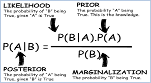

> So Naive!

## O que é?

- Algoritmo de classificação que prevê a categoria de um ponto de dado utilizando probabilidade

$$
p(y \mid X)
$$

_Probabilidade de y dado que X é conhecido_

$$
p(y \mid X) = \frac{p(X \mid y)\, p(y)}{p(X)}
$$

### Características

- Viés alto
- Baixa variância
- Presume-se que todas as features são independentes umas das outras
- Todas as features contribuem igualmente para a classificação de um objeto
- Se uma feature é discreta então presume-se uma distribuição multinomial
- Se uma feature é continua, então presume-se uma distribuição normal
- Os dados não devem conter valores nulos
- Método generativo, ou algoritmo de aprendizado generativo
- Aprendizado Supervisionado

## Complexidade

## Hiperparâmetro

Não utiliza hiperparâmetro

## Etapas

## Vantagens

- Performa bem em conjuntos de dados pequenos
- Pode ser utilizado em classificação multi-classe
- Pode ser utilizado em treino incremental

## Desvantagens

- Se um valor categórico está presente no conjunto de dados de teste, mas não estava presente no conjunto de dados de treino, o modelo atribuirá probabilidade 0. Isso é conhecido como **Zero Frequency**. Para resolver isso podemos utilizar a estimativa de Laplace.
- Na vida real é quase impossível um conjunto de preditores completamente independentes.

## Aplicação

- Filtrar emails de spam
- Classificação de texto
- Diagnósticos médicos
- Análise de sentimento
- Score de crédito
- Previsão de tempo
- Sistemas de recomendação

## Comparação

### Multinomial Naive Bayes Classifier

É utilizado quando as features representam a frequência de termos como contagem de palavras em um documento. É comumente aplicado a classificação de texto, onde frequências são importantes

### Gaussian Naive Bayes Classification

Assume-se que valores continuos associados a cada cada feature são distribuídos de acordo com a distribuição Gaussiana normal

### Bernoulli Naive Bayes

Lida com features binárias, onde cada feature indica se uma palavra aparece ou não em um documento. É utilizada em scenarios onde a presença ou ausência de termos é mais importante que sua frequência

## Dicas

## Utilização

## Links úteis

- [Python Data Science Handbook](https://jakevdp.github.io/PythonDataScienceHandbook/)
