Content Delivery Network/Cache

- Distribui conteúdos de buckets S3 globalmente, por exemplo um site estático uma vez que os conteúdos de um bucket sao regionais

## Preço

- Price Class All: todas regiões
- Price Class 200: Maioria das regiões exceto as mais caras
- Price class 100: Apenas as regiões mais baratas

## Cloudfront + VPC origin e ALB ou EC2 privados

```mermaid
architecture-beta
    group vpc (logos:aws-vpc)[VPC]
    group subnet (logos:aws-subnet)[private subnet] in vpc

    service cloudfront(logos:aws-cloudfront)[Cloudfront]
    service vpce(logos:aws-vpc)[VPC Origin] in vpc
    service ec2(logos:aws-ec2)[EC2 Instance] in subnet

    cloudfront:R -- L:vpce
    vpce:R -- L:ec2

```

## Relacionado

- [[swe.cloud.aws.services.s3]]
