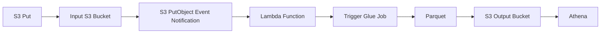

## Transformação de dados para o formato parquet

```mermaid
graph LR
    A[S3 Put] --> B[Input S3 Bucket]
    B --> C[S3 PutObject Event Notification]
    C --> D[Lambda Function]
    %% Or Event Bridge
    D --> E[Trigger Glue Job]
    E --> F[Parquet]
    F --> G[S3 Output Bucket]
    G --> H[Athena]
```

## Relacionado

- [[swe.cloud.aws.services.data-analytics.glue]]
