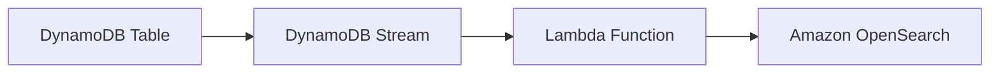
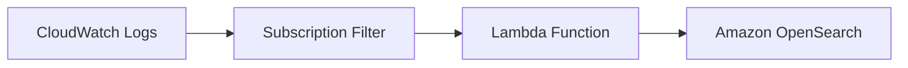

## DynamoDB

- Tabela DynamoDB
- DynamoDB Stream
- Lambda Function
- Amazon OpenSearch

## CloudWatch

- CloudWatch Logs
- Subscription Filter
- Lambda Function/Kinesis Firehose
- Amazon OpenSearch

## Relacionado

- [[swe.cloud.aws.services.data-analytics.open-search]]

#SWE #Cloud #AWS #AWSServices #DataAnalytics #AmazonOpenSearch
