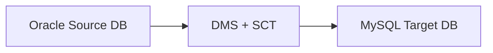

# AWS Schema Conversion Tool (SCT)

- **Não é necessário quando a migração é para a mesma `engine`**

## Casos de Uso

- Converter o schema de um banco de dados de uma `engine` para a outra

## Features

- OLAP -> OLAP
- OLTP -> OLTP

## Relacionado

- [[swe.cloud.aws.services.dms]]
- [[daily.journal.2025.06.25]]
