- Dados em _tempo real_ (Stream)
- Retenção de dados por 365 dias
- Dados não podem ser deletados até que expirem
- Dados até 1MB
- Criptografia KMS/HTTP
- Kinesis Producer Library (KPL) para escrever uma aplicação producer otimizada
- Kinesis Client Library (KCL) para escrever uma aplicação consumer otimizada

```mermaid
architecture-beta
    service producer1(logos:aws-ec2)[EC2 Producer 1]
    service producer2(logos:aws-ec2)[EC2 Producer 2]
    service kinesis(logos:aws-kinesis)[Kinesis Data Stream]
    service consumer1(logos:aws-lambda)[Lambda Consumer 1]
    service consumer2(logos:aws-lambda)[Lambda Consumer 2]


    junction junction1
    junction junction2
    junction junction3

    producer1:T -- B:junction1
    producer2:B -- T:junction1
    junction1:R --> L:kinesis

    kinesis:R --> L:junction2
    junction2:T -- B:consumer2
    junction2:B -- T:consumer1
```

## Provisioned Mode

- Escolha do numero de `shards`
- Cada `shard` recebe até 1MB/s (ou 1000 registros por segundo)
- Cada `shard` pode enviar até 2MB/s
- Escala manual do numero de `shards`
- Pagamento por `shards` provisionada por hora

## On-demand mode

- Não é necessário provisionar ou gerenciar a capacidade
- Capacidade padrão provisionada de entrada (4MB/s ou 4000 registros por segundo)

#SWE #Cloud #AWS #AWSServices #AmazonKinesis
