Simple Queue Service

- Desacoplar aplicações

## Standard Queue

- Retenção de 4 a 14 dias
- Baixa Latência (Menos que 10 ms entre envio e recebimento)
- Limite de 256KB por mensagem
- Pode ter mensagens duplicadas
- Pode ter mensagens fora de ordem
- Pode fornecer ao consumidor até 10 mensagens por vez
- Consumers recebem mensagens em paralelo
- Quando um consumidor recebe a mensagem deve deletar para que outros não a consumam
- pode ser utilizado com consumidores EC2 em um auto scaling group, dado o numero de mensagens na fila o numero de instancias EC2 aumenta para processa-las

```mermaid
architecture-beta
    service producer1(logos:aws-ec2)[EC2 Producer 1]
    service producer2(logos:aws-ec2)[EC2 Producer 2]
    service sqs(logos:aws-sqs)[Simple Queue Service]
    service consumer1(logos:aws-lambda)[Lambda Consumer 1]
    service consumer2(logos:aws-lambda)[Lambda Consumer 2]
    service database(logos:aws-rds)[RDS Database]

    junction junction1
    junction junction2
    junction junction3

    producer1:T -- B:junction1
    producer2:B -- T:junction1
    junction1:R --> L:sqs

    sqs:R --> L:junction2
    junction2:T -- B:consumer2
    junction2:B -- T:consumer1

    consumer2:R --> B:database
    consumer1:R --> T:database
```

#SWE #Cloud #AWS #AWSServices #AmazonSQS
