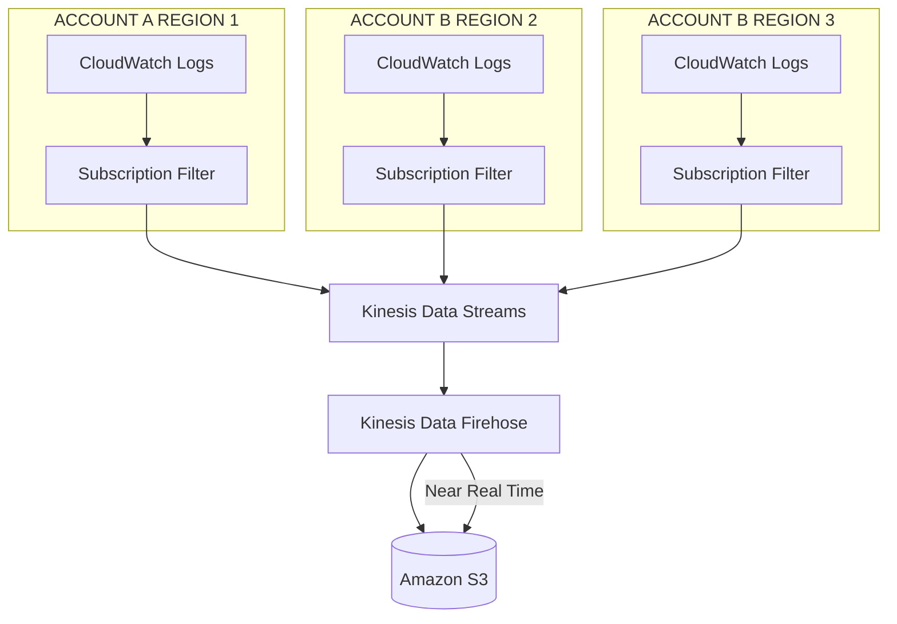

## Features

- Log groups
- Log Streams
- Logs insights (Consulta de logs)
- Logs agent (EC2, _On-premise_)
- Live Tail
- Envio de logs ao S3, Kinesis Data Streams, Kinesis Data Firehose, AWS Lambda e OpenSearch
- Criptografia por padrão
- Criptografia via KMS

## Agradação de logs multi-região e multi-conta

## Relacionado

- [[swe.cloud.aws.services.monitoring-audit.cloud-watch]]

#SWE #Cloud #AWS #AWSServices #Monitoring #AmazonCloudWatch
