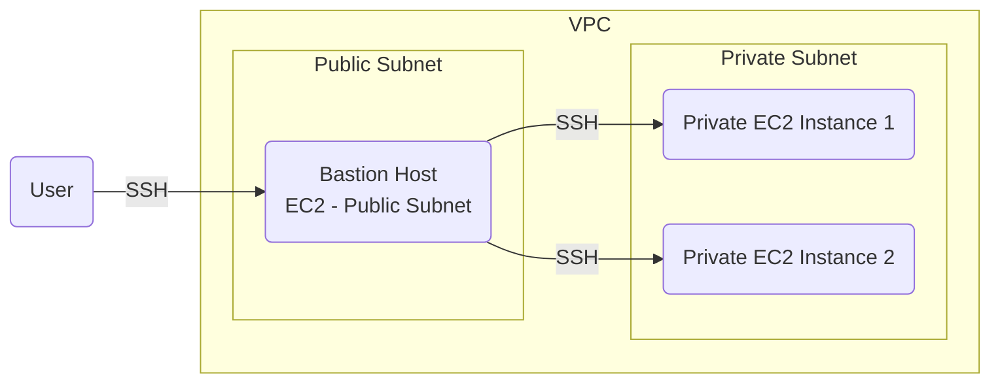

```mermaid
flowchart LR
    user(User) -->|SSH| bastion(Bastion Host<br>EC2 - Public Subnet)
    bastion -->|SSH| private1(Private EC2 Instance 1)
    bastion -->|SSH| private2(Private EC2 Instance 2)

    subgraph VPC
        subgraph Public Subnet
            bastion
        end
        subgraph Private Subnet
            private1
            private2
        end
    end
```

## Relacionado

- [[daily.journal.2025.06.14]]
- [[swe.cloud.aws.services.network.subnet]]

#SWE #Cloud #AWS #AWSServices #Network #BastionHost
