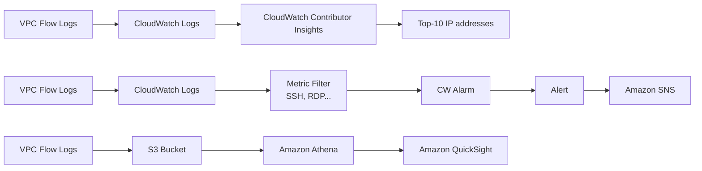

## Casos de Uso

- Captura de informação sobre trafego de IP
- Monitoramento e resolução de problemas de conectividade

## Features

- Integração com _S3_ [[swe.cloud.aws.services.s3]], _CloudWatch_ [[swe.cloud.aws.services.monitoring-audit.cloud-watch]] e _Kinesis Firehose_ [[swe.cloud.aws.services.integration.data-firehose]]
- Captura informação de rede de serviços como _ELB_ [[swe.cloud.aws.services.elb]], _RDS_ [[swe.cloud.aws.services.rds]], _ElastiCache_ [[swe.cloud.aws.services.elasticache]], _Redshift_ [[swe.cloud.aws.services.data-analytics.redshift]], e etc

## Leitura de logs

## Relacionado

- [[daily.journal.2025.06.15]]
- [[swe.cloud.aws.services.network.vpc]]

#SWE #Cloud #AWS #AWSServices #Network #AmazonVPC
