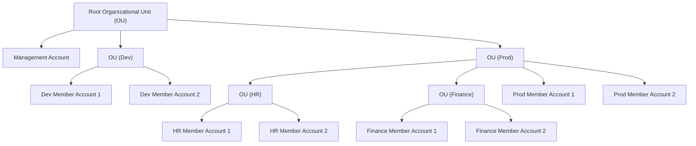

Gerenciamento de múltiplas contas da AWS

## Features

- Cobrança centralizada
- Método de pagamento unificado
- Benefícios de preço (Desconto por volume)
- Compartilhar _Reserved Instances_ e _Saving Plans_ entre contas
- Conta principal de gerenciamento
- API para criação de contas de forma automatizada
- [_Organization Units_](#Organization-Units)

## Benefícios

- Padrões de tagueamento para Finops
- CloudTrail com logs centralizados no S3 de uma única conta
- CloudWatch com logs centralizados em uma única conta
- [_SCP (Security Service Control Polices)_](#SCP)

## SCP

- Politicas IAM aplicadas a _Organization Units_ ou contas para restringir acessos de usuários

## Organization Units

## Relacionado

- [[daily.journal.2025.05.27]]

#SWE #Cloud #AWS #AWSServices #AmazonOrganizations
