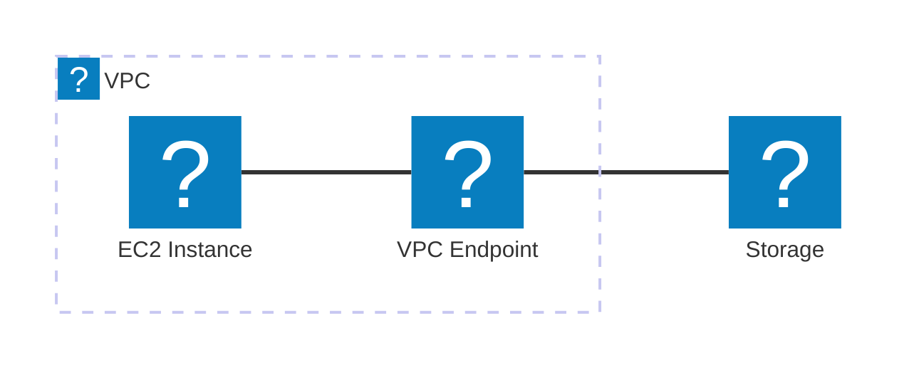

## Access Point

Acessos segmentado a objetos do bucket via politicas de acesso e dns próprio

## Access Point - VPC Origin

```mermaid
architecture-beta
    group vpc (logos:aws-vpc)[VPC]
    service ec2(logos:aws-ec2)[EC2 Instance] in vpc
    service vpce(logos:aws-vpc)[VPC Endpoint] in vpc

    service s3(logos:aws-s3)[Storage]

    ec2:R -- L:vpce
    vpce:R -- L:s3

```

[[swe.cloud.aws.services.s3]]

#SWE #Cloud #AWS #AWSServices #AmazonS3
