## Casos de Uso

- AWS Lambda [[swe.cloud.aws.services.serverless.lambda]] + API GATeway: sem necessidade de gerenciar infraestrutura

## Features

- Suporte ao protocolo WebSocket
- Versionamento de APIs
- Ambientes (dev, test, prod)
- Segurança (Autenticação e autorização)
- Criação de chaves de api
- _Request throttling_
- Possibilidade de utilização dos schemas de Swagger/OpenAPI para definição de apis
- Transformar e validar requisições e respostas
- Gerar especificações de SDK e API
- Armazenar em Cache respostas da API

## Diagramas

- **Arquitetura Serverless**:

```mermaid
architecture-beta

    service s3(logos:aws-s3)[S3]
    service apigateway(logos:aws-api-gateway)[apigateway]
    service lambda(logos:aws-lambda)[Lambda]
    service dynamodb(logos:aws-dynamodb)[DynamoDB]

    %% Static site
    s3:R -- L:apigateway

    %% Proxy requests
    apigateway:R -- L:lambda

    %% CRUD
    lambda:R -- L:dynamodb
```

## Relacionado

- [[daily.journal.2025.05.17]]

#SWE #Cloud #AWS #AWSServices #Serverless #AmazonAPIGateway
