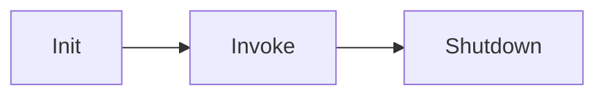
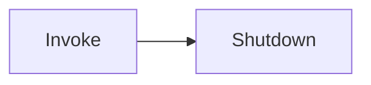

Ciclo de vida Lambda

Com Snap Start

- Melhora a performance de funções lambda até 10x sem custos extras para Java, Python e .NET
- Quanto utilizado, a função é invocada de um estado pré-inicializado

[[swe.cloud.aws.services.serverless.lambda]]

#SWE #Cloud #AWS #AWSServices #Serverless #AmazonLambda
