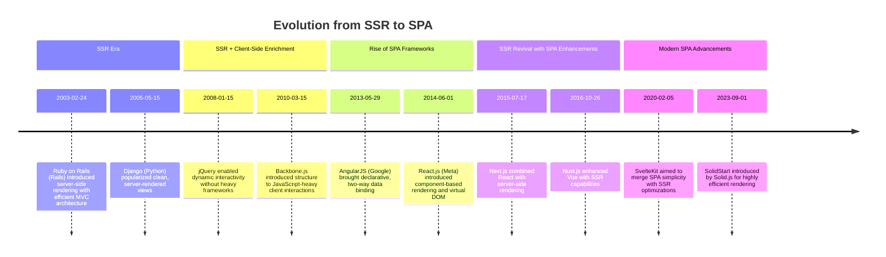

## Timeline: SSR to SPA

```mermaid
timeline
    title Evolution from SSR to SPA
    dateFormat YYYY-MM-DD

    section SSR Era
    2003-02-24 : Ruby on Rails (Rails) introduced server-side rendering with efficient MVC architecture
    2005-05-15 : Django (Python) popularized clean, server-rendered views

    section SSR + Client-Side Enrichment
    2008-01-15 : jQuery enabled dynamic interactivity without heavy frameworks
    2010-03-15 : Backbone.js introduced structure to JavaScript-heavy client interactions

    section Rise of SPA Frameworks
    2013-05-29 : AngularJS (Google) brought declarative, two-way data binding
    2014-06-01 : React.js (Meta) introduced component-based rendering and virtual DOM

    section SSR Revival with SPA Enhancements
    2015-07-17 : Next.js combined React with server-side rendering
    2016-10-26 : Nuxt.js enhanced Vue with SSR capabilities

    section Modern SPA Advancements
    2020-02-05 : SvelteKit aimed to merge SPA simplicity with SSR optimizations
    2023-09-01 : SolidStart introduced by Solid.js for highly efficient rendering
```

[[swe.frontend.ssr-vs-spa]]

#SWE #FrontEnd #RenderingPatterns #SSR #SPA
