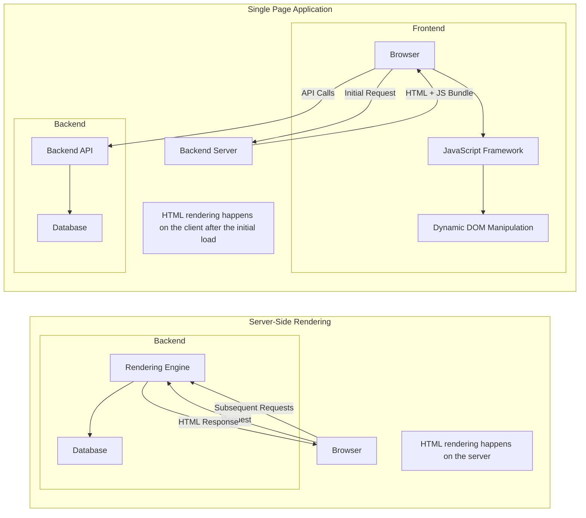

## Diagram: SSR vs. SPA Architecture (Side-by-Side)

```mermaid
graph LR
    subgraph SSR [Server-Side Rendering]
        A[Browser] -->|Request| B[Backend Server]
        B -->|HTML Response| A
        subgraph Backend_SSR [Backend]
            B[Rendering Engine] --> C[Database]
        end
        A -->|Subsequent Requests| B
        SSRNote[HTML rendering happens on the server]
    end

    subgraph SPA [Single Page Application]
        D[Browser] -->|Initial Request| E[Backend Server]
        E -->|HTML + JS Bundle| D
        subgraph Frontend_SPA [Frontend]
            D --> F[JavaScript Framework]
            F --> G[Dynamic DOM Manipulation]
        end
        D -->|API Calls| H[Backend API]
        subgraph Backend_SPA [Backend]
            H --> I[Database]
        end
        SPANote[HTML rendering happens on the client after the initial load]
    end
```

[[swe.frontend.rendering-patterns]]

#FrontEnd #RenderingPatterns #SSR #SPA
