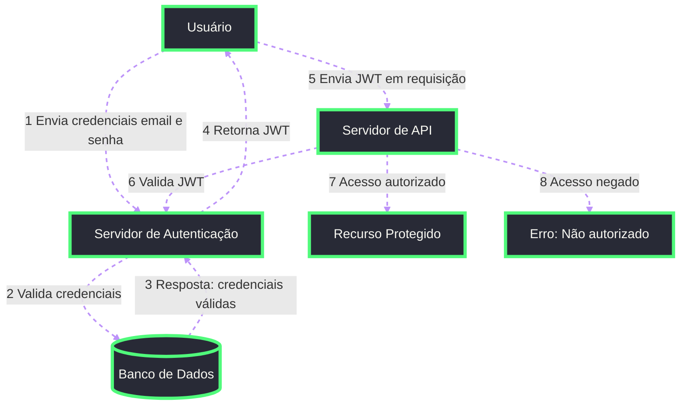

## JWT

Json Web Token

- Token único
- Nao modificável
- Stateless

```sh
Authentication: Barer {JWT}
```

Um token jwt possui o seguinte formato: `header.payload.sign`

**Header**:

```json
{
  "alg": "algoritmo",
  "typ": "JWT"
}
```

**Payload**:

```json
{
  "sub": "subject (id do usuário)"
  // ...
}
```

## Como funciona?



## Recursos

- [JWT.io](https://jwt.io/)
